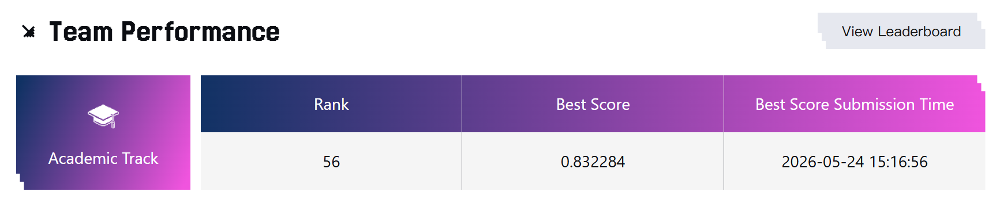

# TAAC Rank 56 - 0.832284 AUC

Team Name: Acloudysky



得益于 DIN MLP 这条更轻的路线，抽到好卡时可以 6mins/epoch，甚至能够有机会二分调参 reinit_threshold. 然而一次一次的 AUC 告诉我，复杂主干不一定是这份数据上最稳的方向。大量的实验其实来自焦虑，最后每天的 3 次 AUC 机会基本就是乱选。

最后提供一些我的小策略吧：
1. 关于夜间训练 OOM，可以通过脚本自动检测 Job Failed，然后 POST Run 请求即可。
2. 在一个 idea 已经落地时趁早 AUC，如果成了，能尽早拿到更优的底座进行迭代。
3. 多进行文档记录，多做一些可观测的指标，以选择更优的 Epoch，有时以前做的消融实验说不定哪天就能用上，例如我最后这两天猛猛上分基本都得益于以前对数据完整 EDA 和单模块消融，还有就是不要感觉两个策略能同时 Work 就一锅乱炖，尽量单个做消融。

最后两天真正改变局面的，是把实验重心专向对线上测试集的未来时间窗口对齐，同时对每个怀疑点做 AUC 消融。DIN 架构训练足够快，抽到好卡时可以做到约 6mins/epoch.

## 最初的 HyFormer 架构尝试

AUC: 0.827931

HyFormer 这类 token 交互主干表达力更强，但训练慢、调参成本高。DIN 的好处是结构更直接：先把候选 item 表示出来，再用它去 attention 用户历史序列，最后把用户、item、样本时间、序列兴趣拼起来过 MLP。它牺牲了一部分复杂交互能力，换来了更快的训练速度和更清晰的特征归因。

总体的 Timeline 如下：

0. 官方 Baseline 保持不动，AUC 是 0.812077。
1. 官方 Baseline 打开 AMP 和 Compile，AUC 下降到 0.810159；官方 Baseline 使用 95% 训练数据，AUC 下降到 0.811467。
2. 在 Baseline 基础上加入样本级绝对时间特征，只保留 Weekday 和 Hour，不做周期编码，直接加入到 User Dense 侧，AUC 涨到 0.824471。
3. 加入 item context 之后没有一份完全干净的单点 AUC，但反向消融能看出它提供过有效信息：关闭 item context residual 的 AUC 是 0.825670，只对 item 83 到 85 层级特征做 residual 建模的 AUC 是 0.826814。更合理的理解是，item 侧状态和层级确实有信息，但需要控制它的表达范围。
4. 加入 user dense 和 user int 的同源 pair 编码。只保留 62 到 66 的同源 pair 对齐特征时，AUC 是 0.826989；早期最强融合版把样本时间、user dense 拆分、item context 和 pair 对齐放在一起，AUC 是 0.827347。这一步让模型显式知道，同一个 fid 下的离散身份和连续统计应该放在一起看。
5. 将 dense 优化器改为 Muon，AUC 到 0.827931。这是 HyFormer 主线最后一个明确涨点，但代价是训练速度变慢接近一倍。到这里为止，HyFormer 主干再怎么加模块都很难继续涨，于是接下来进入 DIN 的搭建阶段。

## 搭起 DIN MLP 的底座

DIN 版本保留了原来数据读取、稀疏特征、dense 特征和多域行为序列这些输入，但把序列主干从 HyFormer 的 query token 加 block 交互，改成了 candidate item 作为 query 的 DIN attention。也就是说，原来是先把非序列 token 和四路序列 token 放进 HyFormer block 里交互；现在是先得到 `item_repr`，再用它分别去四路行为序列里做 target attention，最后把用户表示、物品表示、样本时间、活跃度和四路兴趣向量拼起来过 MLP。

`BestHyFormer/train/model.py`

```python
        # ================== HyFormer 组件 ==================
        # MultiSeqQueryGenerator 查询生成器
        self.query_generator = MultiSeqQueryGenerator(
            d_model=d_model,
            num_ns=self.num_ns,
            num_queries=num_queries,
            num_sequences=self.num_sequences,
            hidden_mult=hidden_mult,
        )

        # MultiSeqHyFormerBlock 堆叠
        self.blocks = nn.ModuleList(
            [
                MultiSeqHyFormerBlock(
                    d_model=d_model,
                    num_heads=num_heads,
                    num_queries=num_queries,
                    num_ns=self.num_ns,
                    num_sequences=self.num_sequences,
                    seq_encoder_type=seq_encoder_type,
                    hidden_mult=hidden_mult,
                    dropout=dropout_rate,
                    top_k=seq_top_k,
                    causal=seq_causal,
                    rank_mixer_mode=rank_mixer_mode,
                )
                for _ in range(num_hyformer_blocks)
            ]
        )
...
        # 3. 通过 MultiSeqQueryGenerator 为每条序列生成独立 Q token
        q_tokens_list = self.query_generator(
            ns_tokens, seq_tokens_list, seq_masks_list
        )

        # 4. Dropout + MultiSeqHyFormerBlock 堆叠 + 输出投影
        output = self._run_multi_seq_blocks(
            q_tokens_list,
            ns_tokens,
            seq_tokens_list,
            seq_masks_list,
            apply_dropout=self.training,
        )
        if self.use_item_context:
            output = output + self._build_item_context(item_ns)
        if self.aligned_user_pair_residual is not None:
            output = output + self.aligned_user_pair_residual(inputs)

        # 5. 分类器
        logits = self.clsfier(output)  # (B, action_num)
        return logits
```

`BestDIN/train/model.py`

```python
class DINAttention(nn.Module):
    """Candidate-conditioned attention over one behavior sequence."""

    def __init__(
        self, d_model: int, hidden_mult: int = 2, dropout: float = 0.0
    ) -> None:
        super().__init__()
        hidden_dim = d_model * hidden_mult
        self.mlp = nn.Sequential(
            nn.Linear(d_model * 4, hidden_dim),
            nn.SiLU(),
            nn.Dropout(dropout),
            nn.Linear(hidden_dim, 1),
        )

    def forward(
        self,
        item_query: torch.Tensor,
        seq_tokens: torch.Tensor,
        seq_lens: torch.Tensor,
        attention_bias: Optional[torch.Tensor] = None,
    ) -> torch.Tensor:
        batch_size, seq_len, d_model = seq_tokens.shape
        query = item_query.unsqueeze(1).expand(-1, seq_len, -1)
        attn_input = torch.cat(
            [query, seq_tokens, query - seq_tokens, query * seq_tokens], dim=-1
        )
        scores = self.mlp(attn_input).squeeze(-1)
        if attention_bias is not None:
            scores = scores + attention_bias.to(dtype=scores.dtype)
        positions = torch.arange(seq_len, device=seq_tokens.device).unsqueeze(0)
        valid = positions < seq_lens.long().unsqueeze(1)
        scores = scores.masked_fill(~valid, -1e9)
        weights = torch.softmax(scores, dim=1) * valid.float()
        weights = weights / weights.sum(dim=1, keepdim=True).clamp_min(1e-6)
        return torch.bmm(weights.unsqueeze(1), seq_tokens).squeeze(1)
```

`BestDIN/train/model.py`

```python
        self.user_sparse_encoder = SparseFeatureEncoder(
            user_int_feature_specs,
            emb_dim,
            d_model,
            emb_skip_threshold,
            hash_config=self.user_hash_config,
        )
        self.item_sparse_encoder = SparseFeatureEncoder(
            item_int_feature_specs,
            emb_dim,
            d_model,
            emb_skip_threshold,
            hash_config=self.item_hash_config,
        )
        self.user_dense_encoder = SeparatedUserDenseEncoder(
            user_dense_feature_specs,
            user_int_pair_feature_specs,
            emb_dim,
            d_model,
            emb_skip_threshold,
        )
        self.item_dense_encoder = DenseFeatureEncoder(item_dense_dim, d_model)
        self.sample_time_encoder = SampleTimeEncoder(emb_dim, d_model)
        self.activity_encoder = DenseFeatureEncoder(
            len(self.seq_domains) * ACTIVITY_FEATURES_PER_DOMAIN, d_model
        )
        self.seq_encoders = nn.ModuleDict(
            {
                domain: SequenceFeatureEncoder(
                    vocab_sizes,
                    emb_dim,
                    d_model,
                    emb_skip_threshold,
                    hash_config=self.seq_hash_config.get(domain, {}),
                )
                for domain, vocab_sizes in seq_vocab_sizes.items()
            }
        )
        self.seq_attentions = nn.ModuleDict(
            {
                domain: DINAttention(
                    d_model, hidden_mult=2, dropout=dropout_rate
                )
                for domain in self.seq_domains
            }
        )
```

`BestDIN/train/model.py`

```python
def _encode_base(
    self, inputs: ModelInput
) -> Tuple[torch.Tensor, torch.Tensor]:
    user_repr = self.user_sparse_encoder(
        inputs.user_int_feats
    ) + self.user_dense_encoder(
        inputs.user_dense_feats, inputs.user_int_feats
    )
    item_repr = self.item_sparse_encoder(
        inputs.item_int_feats
    ) + self.item_dense_encoder(inputs.item_dense_feats)
    return user_repr, item_repr

def _encode_interests(
    self, inputs: ModelInput, item_repr: torch.Tensor
) -> List[torch.Tensor]:
    interests: List[torch.Tensor] = []
    for domain in self.seq_domains:
        seq = inputs.seq_data[domain]
        seq_tokens = self.seq_encoders[domain](seq)
        interests.append(
            self.seq_attentions[domain](
                item_repr,
                seq_tokens,
                inputs.seq_lens[domain],
                attention_bias=self._build_recency_attention_bias(
                    domain, seq
                ),
            )
        )
    return interests

def forward(self, inputs: ModelInput) -> torch.Tensor:
    user_repr, item_repr = self._encode_base(inputs)
    interests = self._encode_interests(inputs, item_repr)
    if interests:
        interest_stack = torch.stack(interests, dim=1)
        global_interest = interest_stack.mean(dim=1)
        interest_parts = interests
    else:
        global_interest = torch.zeros_like(item_repr)
        interest_parts = []

    features = torch.cat(
        [
            user_repr,
            item_repr,
            self.sample_time_encoder(inputs.sample_time_feats),
            self.activity_encoder(inputs.activity_feats),
            *interest_parts,
            global_interest * item_repr,
            torch.abs(global_interest - item_repr),
        ],
        dim=-1,
    )
    hidden = self.readout(features)
    return self.classifier(hidden)
```

同时，DIN 版本把原来会被 `emb_skip_threshold` 跳过的部分高基数序列字段，改成显式 Hash Embedding 接回来。训练入口里指定了四个序列字段，模型侧在 `SequenceFeatureEncoder` 中对这些 slot 走 hash embedding 分支。

`BestDIN/train/train.py`

```python
DEFAULT_HASH_EMBEDDING = ""
DEFAULT_SEQ_HASH_EMBEDDING = (
    "seq_b:69:65536:4,seq_c:29:65536:4,seq_c:34:65536:4,seq_c:47:65536:4"
)
...
parser.add_argument(
    "--seq_hash_embedding",
    type=str,
    default=DEFAULT_SEQ_HASH_EMBEDDING,
    help=(
        "Comma-separated seq hash specs by original fid, for example "
        "seq_b:69:65536:4,seq_c:29:65536:4"
    ),
)
```

`BestDIN/train/run.sh`

```bash
python3 -u "${SCRIPT_DIR}/train.py" \
    --emb_skip_threshold 1000000 \
    --seq_hash_embedding seq_b:69:65536:4,seq_c:29:65536:4,seq_c:34:65536:4,seq_c:47:65536:4 \
    --hash_sparse_lr 0.01 \
    ...
```

`BestHyFormer/train/model.py`

```python
    def _embed_seq_domain(
        self,
        seq: torch.Tensor,
        sideinfo_embs: nn.ModuleList,
        proj: nn.Module,
        is_id: List[bool],
        emb_index: List[int],
        time_bucket_ids: torch.Tensor,
    ) -> torch.Tensor:
        """拼接 sideinfo Embedding 并投影到 d_model，从而编码一个序列域。"""
        B, S, L = seq.shape
        emb_list = []
        for i in range(S):
            real_idx = emb_index[i] if i < len(emb_index) else -1
            if real_idx == -1:
                # 被 emb_skip_threshold 跳过的特征：输出零向量
                emb_list.append(
                    seq.new_zeros(B, L, self.emb_dim, dtype=torch.float)
                )
            else:
                emb = sideinfo_embs[real_idx]
                e = emb(seq[:, i, :])  # (B, L, emb_dim)
                if is_id[i] and self.training:
                    e = self.seq_id_emb_dropout(e)
                emb_list.append(e)
        cat_emb = torch.cat(emb_list, dim=-1)  # (B, L, S*emb_dim)
        token_emb = F.gelu(proj(cat_emb))  # (B, L, D)
...
        return token_emb
```

`BestDIN/train/model.py`

```python
class SequenceFeatureEncoder(nn.Module):
    """Embed per-position sequence side-info into token representations."""
...
    def forward(self, seq: torch.Tensor) -> torch.Tensor:
        batch_size, _, seq_len = seq.shape
        pieces: List[torch.Tensor] = []
        for slot, vocab_size in enumerate(self.vocab_sizes):
            emb_real_idx = self.emb_index[slot]
            if emb_real_idx < 0:
                if slot in self.hash_index:
                    hash_info = self.hash_index[slot]
                    values = seq[:, slot, :].long().clamp_min(0)
                    hash_parts: List[torch.Tensor] = []
                    for j in range(hash_info["k"]):
                        hash_idx = _stable_hash_indices(
                            values,
                            hash_info["H"],
                            slot,
                            hash_info["fid"],
                            j,
                        )
                        hash_idx = torch.where(values == 0, 0, hash_idx)
                        hash_parts.append(
                            self.hash_embs[hash_info["start"] + j](hash_idx)
                        )
                    pieces.append(torch.cat(hash_parts, dim=-1))
                    continue
                pieces.append(
                    seq.new_zeros(
                        batch_size, seq_len, self.emb_dim, dtype=torch.float32
                    )
                )
                continue
            values = seq[:, slot, :].long().clamp(min=0, max=vocab_size)
            pieces.append(self.embs[emb_real_idx](values))
```

DIN 版本还把序列时间从单个历史年龄桶，扩展成更贴近 93 分钟预测窗口的多槽时间特征。HyFormer 里每个 domain 只有 `time_bucket`，模型在序列 token 上加一个 `time_embedding`；DIN 里直接把 `age_bucket`、`hour`、`weekday`、`recent_window`、`horizon_age_bucket`、`horizon_window` 写入序列 side info，并在 attention 分数上加入 recency 和 horizon bias。

`BestHyFormer/train/dataset.py`

```python
# 时间差分桶边界（64 条边界 -> 65 个桶：0=填充，1..64）。
BUCKET_BOUNDARIES = np.array([
    5, 10, 15, 20, 25, 30, 35, 40, 45, 50, 55, 60,
    120, 180, 240, 300, 360, 420, 480, 540, 600,
    900, 1200, 1500, 1800, 2100, 2400, 2700, 3000, 3300, 3600,
    5400, 7200, 9000, 10800, 12600, 14400, 16200, 18000, 19800, 21600,
    32400, 43200, 54000, 64800, 75600, 86400,
    172800, 259200, 345600, 432000, 518400, 604800,
    1123200, 1641600, 2160000, 2592000,
    4320000, 6048000, 7776000,
    11664000, 15552000,
    31536000,
], dtype=np.int64)
...
                raw_buckets = np.clip(
                    np.searchsorted(BUCKET_BOUNDARIES, time_diff.ravel()),
                    0,
                    len(BUCKET_BOUNDARIES) - 1,
                )
                buckets = raw_buckets.reshape(B, max_len) + 1
                buckets[ts_padded == 0] = 0
                time_bucket[:] = buckets

            result[f"{domain}_time_bucket"] = torch.from_numpy(
                time_bucket.copy()
            )
```

`BestDIN/train/dataset.py`

```python
SEQ_TIME_FEATURE_VOCAB_SIZES = [
    SEQ_AGE_BUCKET_VOCAB_SIZE,
    SEQ_EVENT_HOUR_VOCAB_SIZE,
    SEQ_EVENT_WEEKDAY_VOCAB_SIZE,
    SEQ_RECENT_WINDOW_VOCAB_SIZE,
    SEQ_AGE_BUCKET_VOCAB_SIZE,
    SEQ_RECENT_WINDOW_VOCAB_SIZE,
]
TIMESTAMP_UTC_OFFSET_SECONDS = 8 * 3600
PREDICTION_HORIZON_SECONDS = 93 * 60
```

`BestDIN/train/dataset.py`

```python
                    time_diff = np.maximum(
                        timestamps.reshape(-1, 1) - ts_padded, 0
                    )
                    boundaries = SEQ_AGE_BUCKET_BOUNDARIES_BY_DOMAIN.get(
                        domain, SEQ_AGE_BUCKET_FALLBACK
                    )
                    age_bucket = (
                        np.clip(
                            np.searchsorted(boundaries, time_diff.ravel()),
                            0,
                            len(boundaries) - 1,
                        ).reshape(B, max_len)
                        + 1
                    )
                    horizon_time_diff = time_diff + PREDICTION_HORIZON_SECONDS
                    horizon_age_bucket = (
                        np.clip(
                            np.searchsorted(
                                boundaries, horizon_time_diff.ravel()
                            ),
                            0,
                            len(boundaries) - 1,
                        ).reshape(B, max_len)
                        + 1
                    )
...
                    recent_window = (
                        np.clip(
                            np.searchsorted(
                                SEQ_RECENT_WINDOW_BOUNDARIES,
                                time_diff.ravel(),
                            ),
                            0,
                            SEQ_RECENT_WINDOW_VOCAB_SIZE - 1,
                        ).reshape(B, max_len)
                        + 1
                    )
                    horizon_window = (
                        np.clip(
                            np.searchsorted(
                                SEQ_RECENT_WINDOW_BOUNDARIES,
                                horizon_time_diff.ravel(),
                            ),
                            0,
                            SEQ_RECENT_WINDOW_VOCAB_SIZE - 1,
                        ).reshape(B, max_len)
                        + 1
                    )
...
                    out[:, slots["age_bucket"], :] = age_bucket
                    out[:, slots["hour"], :] = hour
                    out[:, slots["weekday"], :] = weekday
                    out[:, slots["recent_window"], :] = recent_window
                    out[:, slots["horizon_age_bucket"], :] = horizon_age_bucket
                    out[:, slots["horizon_window"], :] = horizon_window
```

`BestDIN/train/model.py`

```python
SEQ_RECENCY_ATTENTION_BIAS = 0.12
SEQ_HORIZON_RECENCY_ATTENTION_BIAS = 0.18
...
    def _build_recency_attention_bias(
        self, domain: str, seq: torch.Tensor
    ) -> Optional[torch.Tensor]:
        encoder = self.seq_encoders[domain]
        horizon_slot = len(encoder.vocab_sizes) - 1
        recent_slot = horizon_slot - 2
        if recent_slot < 0 or horizon_slot < 0:
            return None
        recent_window = seq[:, recent_slot, :].long()
        horizon_window = seq[:, horizon_slot, :].long()
        valid_recent = recent_window > 0
        valid_horizon = horizon_window > 0
        recency_score = (
            (SEQ_RECENT_WINDOW_COUNT + 1 - recent_window)
            .clamp(min=0, max=SEQ_RECENT_WINDOW_COUNT)
            .to(dtype=torch.float32)
            / float(SEQ_RECENT_WINDOW_COUNT)
        )
        horizon_score = (
            (SEQ_RECENT_WINDOW_COUNT + 1 - horizon_window)
            .clamp(min=0, max=SEQ_RECENT_WINDOW_COUNT)
            .to(dtype=torch.float32)
            / float(SEQ_RECENT_WINDOW_COUNT)
        )
        bias = recency_score.new_zeros(recency_score.shape)
        bias = bias + torch.where(
            valid_recent,
            recency_score * float(SEQ_RECENCY_ATTENTION_BIAS),
            bias,
        )
        bias = bias + torch.where(
            valid_horizon,
            horizon_score * float(SEQ_HORIZON_RECENCY_ATTENTION_BIAS),
            bias.new_zeros(bias.shape),
        )
        return bias
```

DIN 版本也把样本级时间和序列活跃度作为非序列上下文接入。原来的 `ModelInput` 只有 user、item、sequence 和 `seq_time_buckets`；现在 batch 里额外返回 `sample_time_feats` 和 `activity_feats`，模型里分别通过 `SampleTimeEncoder` 和 `DenseFeatureEncoder` 接入最后的 MLP。

`BestHyFormer/train/model.py`

```python
class ModelInput(NamedTuple):
    user_int_feats: torch.Tensor
    item_int_feats: torch.Tensor
    user_dense_feats: torch.Tensor
    item_dense_feats: torch.Tensor
    seq_data: dict  # {domain: 张量 [B, S, L]}
    seq_lens: dict  # {domain: 张量 [B]}
    seq_time_buckets: dict  # {domain: 张量 [B, L]}
```

`BestDIN/train/model.py`

```python
class ModelInput(NamedTuple):
    user_int_feats: torch.Tensor
    item_int_feats: torch.Tensor
    user_dense_feats: torch.Tensor
    item_dense_feats: torch.Tensor
    sample_time_feats: torch.Tensor
    activity_feats: torch.Tensor
    seq_data: Dict[str, torch.Tensor]
    seq_lens: Dict[str, torch.Tensor]
```

`BestDIN/train/dataset.py`

```python
        shifted_sample_ts = timestamps + TIMESTAMP_UTC_OFFSET_SECONDS
        seconds_of_day = shifted_sample_ts % SECONDS_PER_DAY
        seconds_of_week = shifted_sample_ts % SECONDS_PER_WEEK
        sample_time_feats = np.stack(
            [
                ((shifted_sample_ts // 3600) % 24) + 1,
                (((shifted_sample_ts // 86400) + 3) % 7) + 1,
                (seconds_of_day // 60) / 1440.0,
                np.sin(2.0 * np.pi * seconds_of_day / SECONDS_PER_DAY),
                np.cos(2.0 * np.pi * seconds_of_day / SECONDS_PER_DAY),
                timestamps / SAMPLE_ABSOLUTE_TIME_SCALE_SECONDS,
            ],
            axis=1,
        ).astype(np.float32, copy=False)
...
        activity_features = np.zeros(
            (B, len(self.seq_domains) * ACTIVITY_FEATURES_PER_DOMAIN),
            dtype=np.float32,
        )
...
                "sample_time_feats": torch.from_numpy(sample_time_feats.copy()),
                "activity_feats": torch.from_numpy(activity_features.copy()),
```

user dense 在 DIN 里也不是简单把所有 dense 拼起来过一层 Linear，而是把 UE 类字段、同源 int dense pair、较小 UE 字段分开编码后再融合。这里保留了 HyFormer 阶段已经验证过的同源 pair 思路，只是接入到了 DIN 的 user 表示里。

`BestHyFormer/train/model.py`

```python
        self.has_user_dense = user_dense_dim > 0
        if self.has_user_dense:
            self.user_dense_proj = nn.Sequential(
                nn.Linear(user_dense_dim, d_model), nn.LayerNorm(d_model)
            )
...
        if self.has_user_dense:
            user_dense_tok = F.silu(
                self.user_dense_proj(inputs.user_dense_feats)
            ).unsqueeze(1)  # (B, 1, D)
            ns_parts.append(user_dense_tok)
```

`BestDIN/train/model.py`

```python
class SeparatedUserDenseEncoder(nn.Module):
    """Separate UE vectors from aligned int/dense pair features."""
...
        self.main_ue_encoder = DenseFieldGroupEncoder(main_ue_specs, d_model)
        self.pair_encoder = AlignedUserPairEncoder(
            dense_feature_specs=dense_feature_specs,
            int_feature_specs=int_pair_feature_specs,
            emb_dim=emb_dim,
            d_model=d_model,
            emb_skip_threshold=emb_skip_threshold,
        )
        self.small_ue_encoder = DenseFieldGroupEncoder(small_ue_specs, d_model)
        self.fuse = nn.Sequential(
            nn.Linear(d_model * 3, d_model), nn.LayerNorm(d_model)
        )

    def forward(
        self, dense_feats: torch.Tensor, int_feats: torch.Tensor
    ) -> torch.Tensor:
        return F.silu(
            self.fuse(
                torch.cat(
                    [
                        self.main_ue_encoder(dense_feats),
                        self.pair_encoder(int_feats, dense_feats),
                        self.small_ue_encoder(dense_feats),
                    ],
                    dim=-1,
                )
            )
        )
```

最终输出层也从 HyFormer 的单个 `output` 过分类器，变成 DIN 版本的多路表示拼接后过 MLP。这里拼进去的包括 user 表示、item 表示、样本时间、活跃度、四路序列兴趣，以及全局兴趣和 item 的乘积差分交互。

`BestHyFormer/train/model.py`

```python
        output = self._run_multi_seq_blocks(
            q_tokens_list,
            ns_tokens,
            seq_tokens_list,
            seq_masks_list,
            apply_dropout=self.training,
        )
        if self.use_item_context:
            output = output + self._build_item_context(item_ns)
        if self.aligned_user_pair_residual is not None:
            output = output + self.aligned_user_pair_residual(inputs)

        # 5. 分类器
        logits = self.clsfier(output)  # (B, action_num)
        return logits
```

`BestDIN/train/model.py`

```python
        features = torch.cat(
            [
                user_repr,
                item_repr,
                self.sample_time_encoder(inputs.sample_time_feats),
                self.activity_encoder(inputs.activity_feats),
                *interest_parts,
                global_interest * item_repr,
                torch.abs(global_interest - item_repr),
            ],
            dim=-1,
        )
        hidden = self.readout(features)
        return self.classifier(hidden)
```

最终 BestDIN 这条线对应的最高 Eval 是 0.832284。

## 最终 DIN 主线

后期 DIN 主线可以粗略看成下面这条路径。

| 阶段 | AUC | 关键变化 |
| -- | --: | -- |
| DINHash 基线 | 0.828668 | 四个被跳过的序列大表改用 Hash Embedding，形成后期 DINHash 底座 |
| 加入 93 分钟 horizon 对齐 | 0.831227 | 序列时间窗口按未来 93 分钟目标重新对齐，attention bias 使用 0.18 |
| 样本时间口径收敛 | 0.831873 | 保留更稳定的样本时间上下文 |
| 缺失状态口径收敛 | 0.831575 | 让模型更依赖活跃度、序列兴趣和 item 交互 |
| 最终 DIN 输入口径 | 0.832284 | 两个已验证有效的口径合并，成为当前最高 AUC |

这条线最重要的结论是：真正带来线上提升的不是把模型做得更复杂，而是让模型围绕更稳定的泛化信号学习。最后的涨分更多来自时间分布对齐、序列高基数信号和更干净的输入口径，而不是加模块、加容量、加更多显式交互。

## 一句话总结

DIN 最终涨分不是靠更大的模型，也不是靠更激进的时间权重，而是靠三个动作：接回真正有价值的序列高基数信息，把序列时间温和对齐到未来 93 分钟，再把输入口径收敛到更稳定的泛化信号上。最后的 0.832284，本质上是让模型学到更贴近 public test 的东西，而不是多堆东西。
